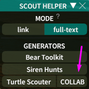
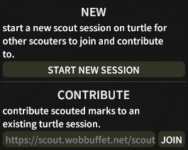
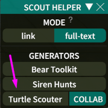
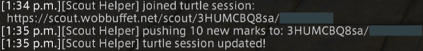

# SCOUT HELPER

a dalamud helper plugin for making it easier to interact with scout trackers.

* [CONTACT](#contact)
* [FEATURES](#features)
* [HOW TO USE](#how-to-use)
	* [COLLABORATIVE SCOUTING](#collaborative-scouting)

# CONTACT

if you have feedback or questions about the plugin, you can reach me at ditzy.
zy@pm.me, or find us in the
[light trains discord](https://discord.gg/9YjuHqVG)'s #tech channel.

# FEATURES

* integrates with multiple scout trackers:
	* [bear toolkit](https://tracker.beartoolkit.com/train)
	* [siren hunts](https://www.sirenhunts.com/scouting)
	* [turtle scouter](https://scout.wobbuffet.net/)
* automatically pulls scouted marks from the
	[hunt helper](https://github.com/imaginary-png/HuntHelper) train recorder
* divide and conquer! scout collaboratively with other scouters, using turtle
	scouter, contributing marks to the same turtle train.
* create a whole template of text including multiple additional fields such as
	the number of marks and the patch. e.g.:

	

# HOW TO USE

1. use hunt helper's train recorder to record hunt marks while you scout

	 

2. open scout helper with the `/scouth` (or `/sch`) command

	 

3. pick a copy mode
	* link -- only copies the generated tracker link to your clipboard.
	* full-text -- copies an entire template to your clipboard including multiple
		train fields beyond just the tracker link.

4. select the tracker website you want to generate a link for. this will copy
	 the link to your clipboard and echo it to the chat log as a backup

	 

5. share the link with your friends ⸜(≧▽≦)⸝

### COLLABORATIVE SCOUTING

with turtle scouter, it is possible to have multiple scouters contribute to the
same train.

1. click the "COLLAB" button next to the turtle scouter generator.

   
2. either generate a new turtle session, or join an existing session using its
	 collaboration link.

	 
3. use the turtle scouter generator button to push your scouted marks to the
	 active turtle session.

	 

	 
	* NOTE: when you first push scouted marks to a session after joining it, your
		whole train will be sent. but after that, only the latest marks that you've
		seen will be sent (the marks scouted since the last time you pushed marks).
