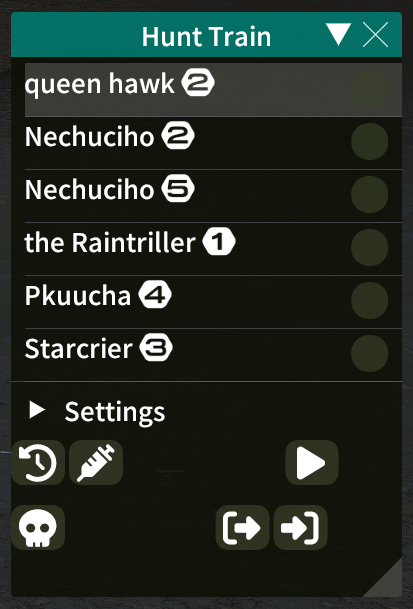
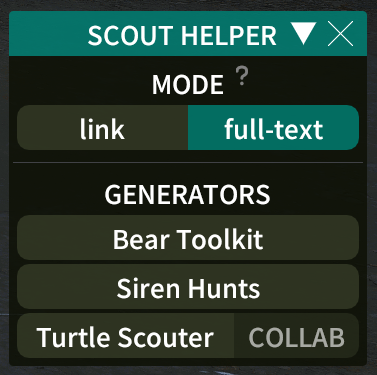

# SCOUT HELPER

a dalamud helper plugin for making it easier to interact with scout trackers

## FEATURES

* integrates with multiple scout trackers:
	* [bear toolkit](https://tracker.beartoolkit.com/train)
	* [siren hunts](https://www.sirenhunts.com/scouting)
	* [turtle scouter](https://scout.wobbuffet.net/)
* automatically pulls scouted marks from the
	[hunt helper](https://github.com/imaginary-png/HuntHelper) train recorder
* create a whole template of text including multiple additional fields such 
  as the number of marks and the patch. e.g.:

## HOW TO USE

1. use hunt helper's train recorder to record hunt marks while you scout

	

2. open scout helper with the `/scouth` (or `/sch`) command

	

3. pick a copy mode
	* link -- only copies the generated tracker link to your clipboard.
	* full-text -- copies an entire template to your clipboard including 
	  multiple train fields beyond just the tracker link.

4. select the tracker website you want to generate a link for. this will copy
   the link to your clipboard and echo it to the chat log as a backup

	

5. share the link with your friends ⸜(≧▽≦)⸝
