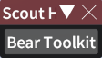
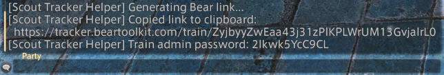

# SCOUT HELPER

a dalamud helper plugin for making it easier to interact with scout trackers

## FEATURES

* integrates with multiple scout trackers:
	* [bear toolkit](https://tracker.beartoolkit.com/train)
	* [siren hunts](https://www.sirenhunts.com/scouting) (next to be implemented)
	* [prime hunt tools](https://prime-hunt-tools.web.app/#/) (planned for the
	  future)
* automatically pulls scouted marks from the
	[hunt helper](https://github.com/imaginary-png/HuntHelper) train recorder

## HOW TO USE

1. use hunt helper's train recorder to record hunt marks while you scout

   

2. open scout helper with the `/scouth` command

   

3. select the tracker website you want to generate a link for. this will copy
   the link to your clipboard and echo it to the chat log as a backup

   

4. share the link with your friends ⸜(≧▽≦)⸝
